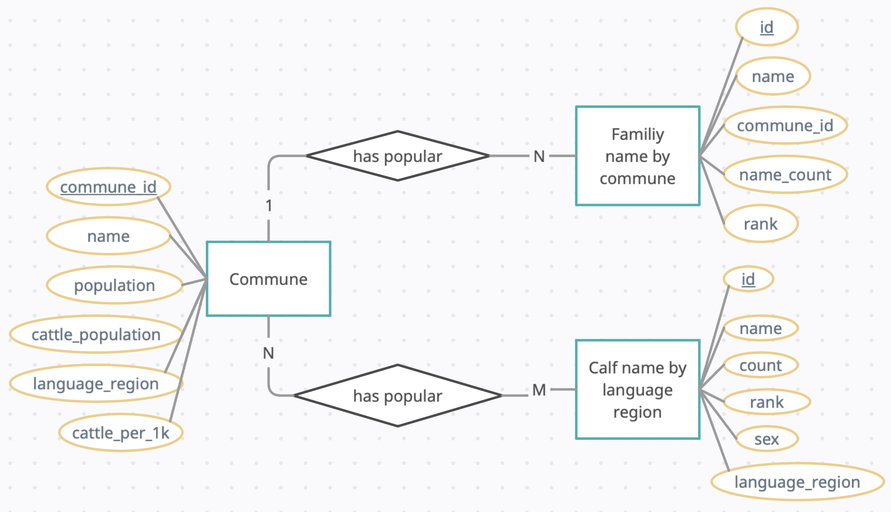

```{r setup, include=FALSE}
knitr::opts_chunk$set(echo = TRUE)
```

# Introduction
For our data integration project we want to determine which Swiss family names are the cowboyest. For this we gathered data that allows us to link familiy name frequency with the number of cattle present in a commune (Gemeinde). We made use of the following data sources:

## gemeinde.csv 
Provides us with the 

- commune identification number
- commune name
- commune population 

Gathered from the Swiss federal geodata portal at data.geo.admin.ch, and converted from an ESRI shapefile into a CSV in QGIS.

## cattle-map-commune.csv
Provides us with

- commune id
- cattle population

Gathered from identitas animal statistics [here](https://tierstatistik.identitas.ch/en/cattle-map-commune.html).

## commune-languageregion.csv
Provides us with

- commune id
- commune language region

Gathered from BFS [here](https://www.bfs.admin.ch/asset/de/2543289).

## familiy-names-commune.csv
Lists the 100 most frequent family names in each commune
Provides us with

- commune id
- family name
- family name count in commune
- family name rank in commune

Gathered from BFS [here](https://www.bfs.admin.ch/bfs/de/home/statistiken/bevoelkerung/geburten-todesfaelle/namen-schweiz.assetdetail.23264914.html).

## cattle-NamesFemaleCalves.csv and cattle-NamesMaleCalves
Lists most popular names for named calves by language region. Provides us with

- calf name
- name count
- name rank
- language region

Gathered from identitas [here](https://tierstatistik.identitas.ch/en/cattle.html).

# Database organization
Using the data above we organize our database according to the following ER diagram. 



Each commune is related to the top 100 family names in that commune. Moreover, each commune is related to the top calf names in the language region(s) it belongs to. In reality, no commune is assigned to multiple language regions although this sould be reasonable in principle.

# Implementing the database
We start by instantiating a database in SQLite.

```{r message=FALSE}
library(tidyverse)
library(DBI)
library(knitr)
```

```{r}
conn <- dbConnect(RSQLite::SQLite(), "cowboys.db")
```

## Commune table
The data in the commune table requires integration from three sources. First we load the commune data from `gemeinde.csv`.
```{r message=FALSE}
communes <- read_csv("input_data/gemeinde.csv")
communes <- communes %>% 
  filter(!is.na(EINWOHNERZ)) %>%
  select(BFS_NUMMER, EINWOHNERZ, NAME) %>%
  rename(commune_id = BFS_NUMMER, population = EINWOHNERZ, name = NAME)

communes %>% sample_n(10) %>% kable()
```

Next we extract the cattle population per commune from `cattle-map-commune.csv`.
```{r message=FALSE}
cattle_population <- read_delim("input_data/cattle-map-commune.csv", 
    delim = ";", escape_double = FALSE, trim_ws = TRUE)
cattle_population <- cattle_population %>% 
  select(MunicipalityNumber, count) %>%
  rename(commune_id = MunicipalityNumber, cattle_population = count)

cattle_population %>% sample_n(10) %>% kable()
```

We then join the cattle population with the commune data using the `commune_id`.
```{r message=FALSE}
communes <- left_join(communes, cattle_population)

communes%>% sample_n(10) %>% kable()
```
Finally, we extract the language region of each commune from `commune-languageregion.csv`.
```{r message=FALSE}
commune_language <- read_delim("input_data/commune-languageregion.csv", 
    delim = ",", escape_double = FALSE, trim_ws = TRUE) %>% 
      select(`Regions-ID`, Sprachgebiete) %>%
      rename(commune_id = `Regions-ID`, language_region = Sprachgebiete)

commune_language$language_region <- recode( commune_language$language_region,
                                        `Deutsches Sprachgebiet` = "de",
                                        `Französisches Sprachgebiet` = "fr",
                                        `Italienisches Sprachgebiet` = "it",
                                        `Rätoromanisches Sprachgebiet` = "rt"
                                          )

commune_language %>% sample_n(10) %>% kable()
```
The result is joined to the commune data via `commune_id`.
```{r message=FALSE}
communes <- left_join(communes, commune_language) 

communes%>% sample_n(10) %>% kable()
```
We calculate the number of cattle per 1000 inhabitants and store this as a new column
```{r}
communes <- communes %>% mutate(cattle_per_1k = cattle_population/population *10^3)
```


We now created a table in the database for the communes with the unique `commune_id` as a primary key.
```{r message=FALSE}
dbExecute(conn, "
  create table if not exists communes (
    commune_id int primary key,
    name text,
    population int,
    language_region text,
    cattle_population int,
    cattle_per_1k real
  )          
")
```
The joined commune data is then loaded into the database.
```{r}
for (i in 1:nrow(communes)) {
  row = communes[i,]
  dbExecute(conn, "
            insert into communes (commune_id, name, population, language_region,
                                    cattle_population, cattle_per_1k)
            values (?, ?, ?, ?, ?,?)",
          params = c(row$commune_id, row$name, 
                     row$population, row$language_region, 
                     row$cattle_population, row$cattle_per_1k))
}
```

We check that this has worked properly by querying the `communes` table.
```{r}
dbGetQuery(conn, "select * from communes limit 10") %>% kable()
```

## Family names table
We now turn to the family names. First we load the data from `family-names-commune.csv`, retaining only the top names in 2021.
```{r message=FALSE}
family_names <-
  read_delim(
    "input_data/family-names-commune.csv",
    delim = ";",
    escape_double = FALSE,
    trim_ws = TRUE
  )
family_names <- family_names %>% 
  filter(TIME_PERIOD == 2021) %>% 
  filter(RANG_GDE <= 100) %>% 
  select(LASTNAME, GDENR, RANG_GDE, VALUE) %>%
  rename(family_name = LASTNAME, commune_id = GDENR, name_rank = RANG_GDE, name_count = VALUE)
  
family_names %>% sample_n(10) %>% kable()
```
Next, we create a table `family_names` in the database with an automatically generated `id` as primary key, and `commune_id` as foreign key linking to the `communes` table.
```{r message = FALSE}
dbExecute(conn, "
  create table if not exists family_names (
    id integer primary key,
    name text,
    commune_id int,
    name_count int,
    rank int,
    foreign key(commune_id) references communes(commune_id)
  )          
")
```
Then we load the data into the created table.
```{r}
pb = txtProgressBar(min = 1, max = nrow(family_names), initial = 1) 

for (i in 1:nrow(family_names)) {
  row = family_names[i,]
  dbExecute(conn, "
            insert into family_names (name, commune_id, name_count, rank)
            values (?, ?, ?, ?)",
          params = c(row$family_name, row$commune_id, row$name_count, row$name_rank))
  
  if (i %% 100 == 0) {
    setTxtProgressBar(pb,i)} 
}
close(pb)
```
Finally, we check that it worked by querying.
```{r}
dbGetQuery(conn, "select * from family_names limit 10") %>% kable()
```

## Calf names table
The last table contains the calf names. We load the data from `cattle-NamesFemaleCalves.csv` and `cattle-NamesMaleCalves.csv`.
```{r message=FALSE}
cattle_NamesFemaleCalves <- read_delim("input_data/cattle-NamesFemaleCalves.csv", 
    delim = ";", escape_double = FALSE, trim_ws = TRUE) %>%
  mutate(sex="F")

cattle_NamesMaleCalves <- read_delim("input_data/cattle-NamesMaleCalves.csv", 
    delim = ";", escape_double = FALSE, trim_ws = TRUE) %>% 
  mutate(sex="M")

cattle_names <- bind_rows(cattle_NamesFemaleCalves, cattle_NamesMaleCalves)
rm(cattle_NamesFemaleCalves, cattle_NamesMaleCalves)

cattle_names <- cattle_names %>% 
  filter(year==2022) %>% 
  filter(OwnerLanguage != "__all__") %>% 
  select(Name, count, Rank, sex, OwnerLanguage) %>%
  rename(name = Name, rank = Rank, language_region = OwnerLanguage)

cattle_names %>% arrange(rank, sex, language_region) %>% head(10) %>% kable()
```
We create the database table `cattle_names` using and automatically generated `id` as primary key, and `language_region` as a foreign key linking to the `communes` table.
```{r message=FALSE}
dbExecute(conn, "
  create table if not exists cattle_names (
    id integer primary key,
    name text,
    count int,
    rank int,
    sex text,
    language_region text,
    foreign key(language_region) references communes(language_region)
  )          
")
```
We then load the data into the database and query to check if it worked.
```{r}
for (i in 1:nrow(cattle_names)) {
  row = cattle_names[i,]
  dbExecute(conn, "
            insert into cattle_names (name, count, rank, sex, language_region)
            values (?, ?, ?, ?, ?)",
          params = c(row$name, row$count, row$rank, row$sex, row$language_region))
  }
```

```{r}
dbGetQuery(conn, "select * from cattle_names limit 10") %>% kable()
```

# Querying the database
We now query the database to see which family names are most popular in communes with the highest cattle density per population.

We can get the communes with the highest cattle density per person as follows.
```{r}
dbGetQuery(conn, "
           select * 
           from communes 
           order by cattle_per_1k desc
           limit 10
           ") %>% kable()
```
We see that the Scheltenites better treat their cattle with care, since in case of cow mutiny they are outnumbered 7:1.

Lets now get all communes that have more than 3 cattle per person. These are the cowboy communes.
```{r}
dbGetQuery(conn, "
           select * 
           from communes 
           where cattle_per_1k > 3000
           order by cattle_per_1k desc
           ") %>% head(n = 10) %>% kable()
```

We can now plug the resulting `commune_id`s of the above query into `family_names` to get a list of the most frequent family names in these high-cow regions. These are the cowboy names.
```{r}
dbGetQuery(conn, "
           select *
           from family_names
           where commune_id in
             (select commune_id
             from communes 
             where cattle_per_1k > 3000)
           
           ") %>% sample_n(10) %>% kable()
```
We can now aggregate this list by `name_count` to get the most frequent cowboy names. We print the top 30 cowboy names
```{r}
dbGetQuery(conn, "
           select name, sum(name_count) name_count
           from family_names
           where commune_id in
             (select commune_id
             from communes 
             where cattle_per_1k > 3000)
           group by name
           order by name_count desc
           
           ") %>% head(n=30) %>% kable()
```

We observe that many of the names are french. Queloz is incidentilly the name of physics nobel laureate Didier Queloz whose research concerns the detection of earth-like exoplanets. Perhaps he is in part motivated to find new pastures for raising cattle.